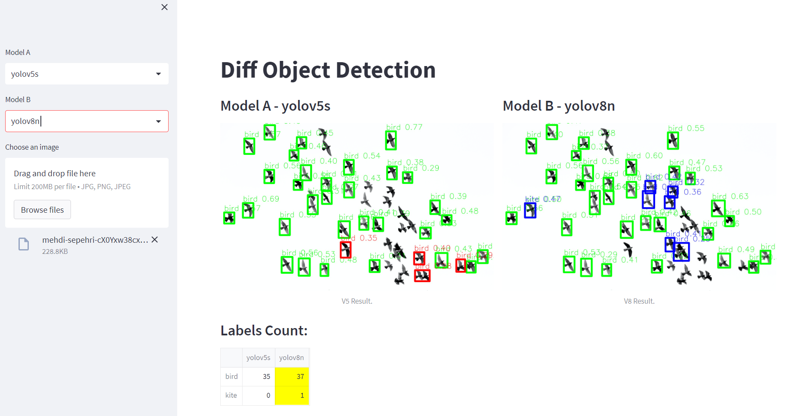

# Diff (DiffOD)

Streamlit App to show difference for 2 different Object Detection models  


## Docker command reference 
### How to build it and run it.

```bash 
# build it
docker build -t diffod:latest .

# run it (CPU)
docker run -it -p 127.0.0.1:8501:8501 diffod:latest

# run it (GPU)
docker run -it 
```

## Reference 
- [yolov5](https://github.com/ultralytics/yolov5)
- [yolov8](https://github.com/ultralytics/ultralytics)
